# Docker

## Phần 1: Các lệnh cơ bản thao tác với Docker

1. docker --version

   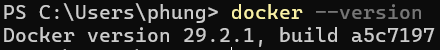

2. docker run hello-world

   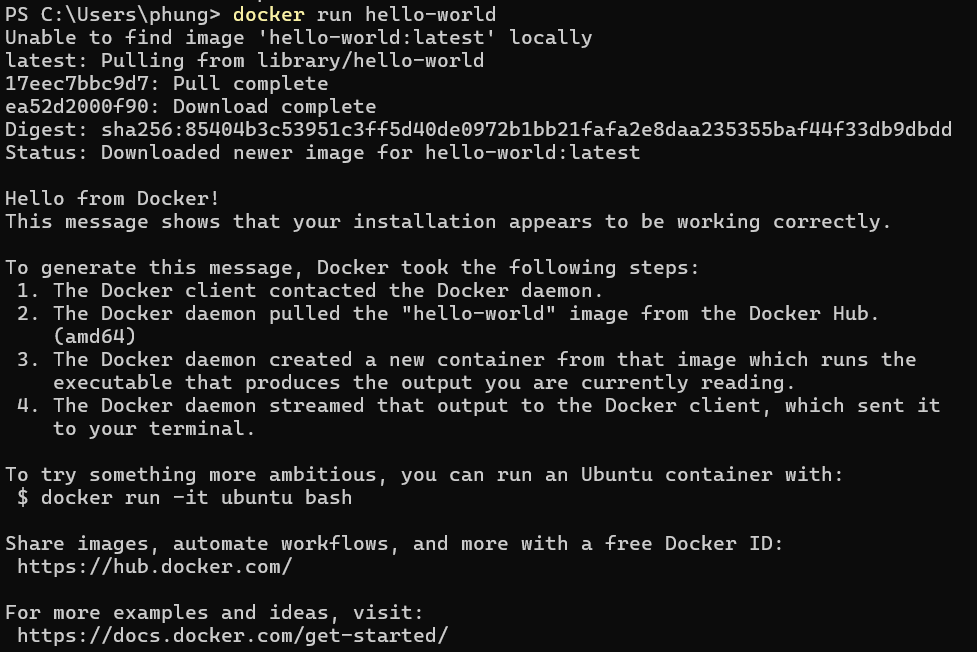

3. docker pull nginx

   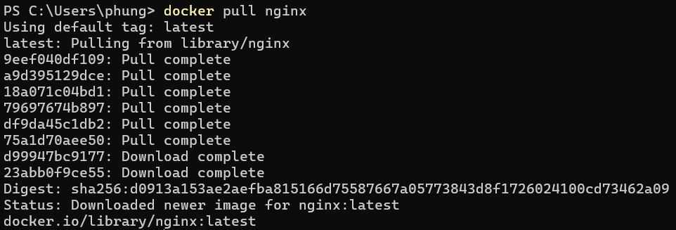

4. docker images

   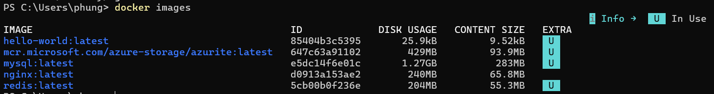

5. docker run -d nginx

   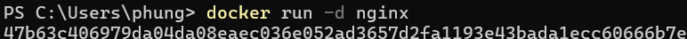

6. docker ps

   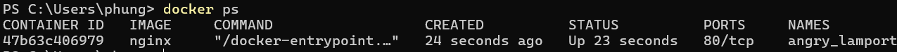

7. docker ps -a

   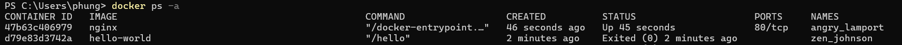

8. docker logs <container_id>

   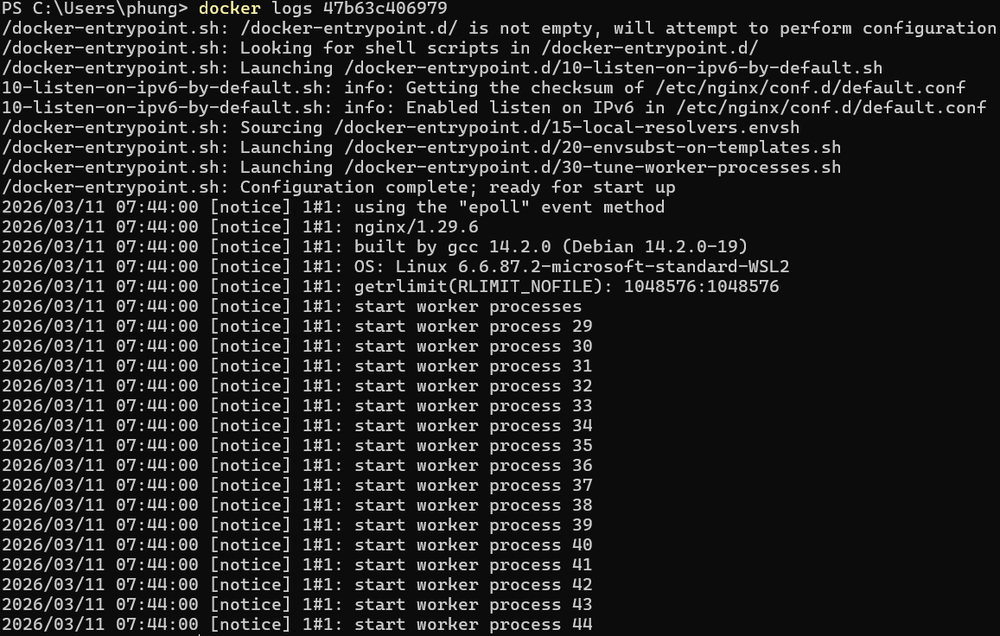

9. docker exec -it <container_id> /bin/sh

   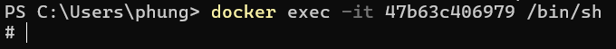

10. docker stop <container_id>

    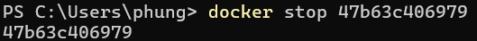

11. docker restart <container_id>

    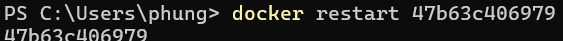

12. docker rm <container_id>

    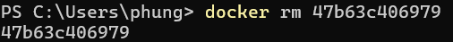

13. docker container prune

    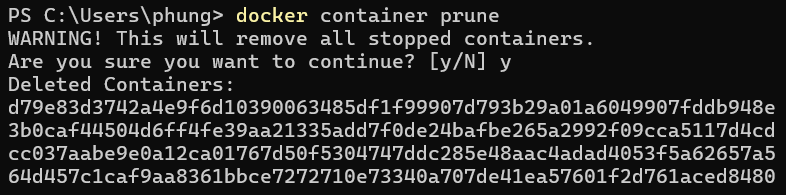

14. docker rmi <image_id>

    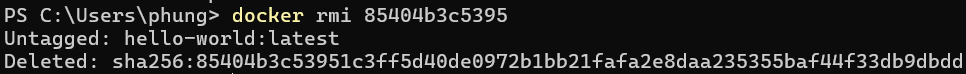

15. docker image prune -a

    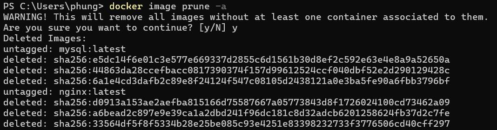

16. docker run -d -p 8080:80 nginx

    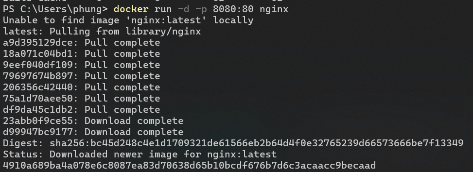

17. docker inspect <container_id>

    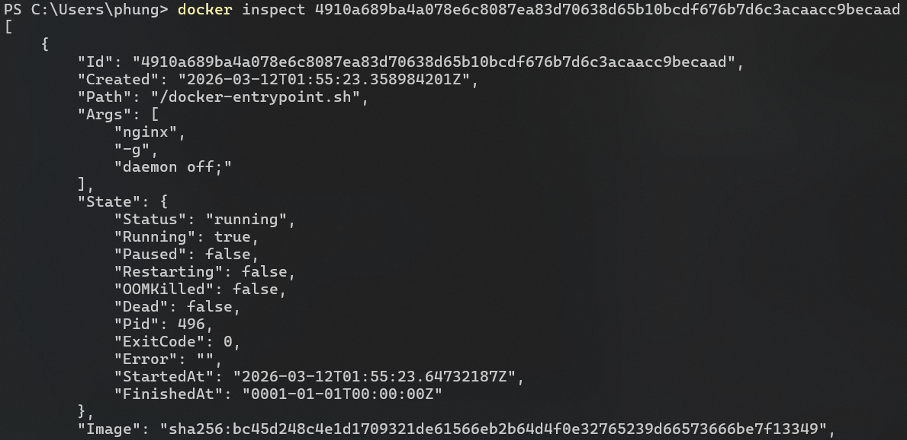

18. docker run -d -v mydata:/data nginx

    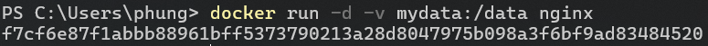

19. docker volume ls

    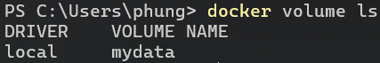

20. docker volume prune

    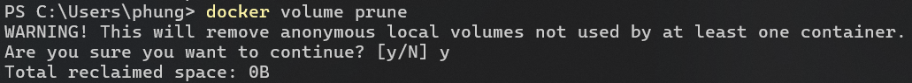

21. docker run -d --name my_nginx nginx

    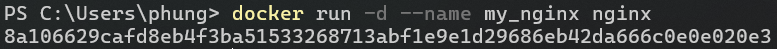

22. docker stats

    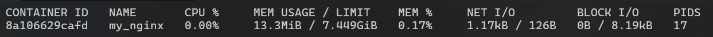

23. docker network ls

    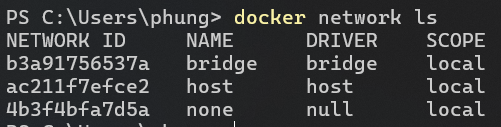

24. docker network create my_network

    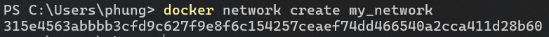

25. docker run -d --network my_network --name my_container nginx

    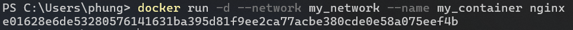

26. docker network connect my_network my_nginx

    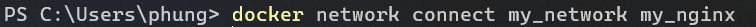

27. docker run -d -e MY_ENV=hello_world nginx

    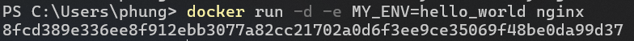

28. docker logs -f my_nginx

    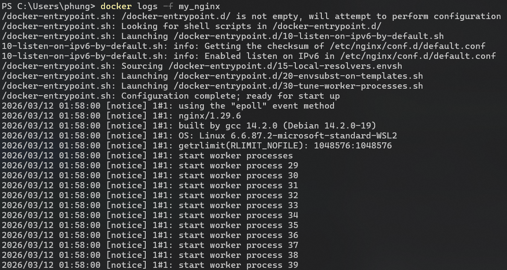

29. Dockerfile
    ```docker
    FROM nginx  
    COPY index.html /usr/share/nginx/html/index.html
    ```
    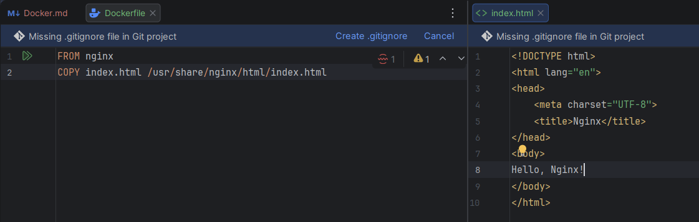
30. docker build -t my_nginx_image .

    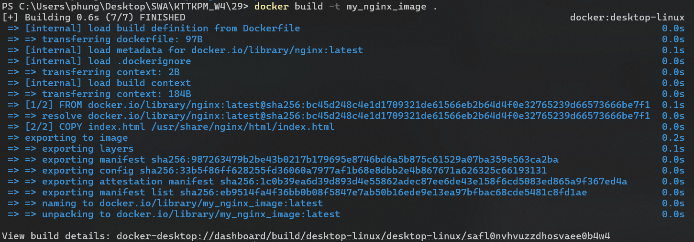
31. docker run -d -p 8080:80 my_nginx_image

    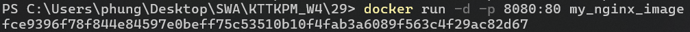
    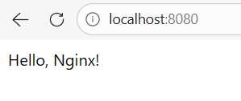

## Phần 2: Thao tác với Dockerfile

1. Tạo Dockerfile chạy một ứng dụng Node.js đơn giản
   > Yêu cầu:  
   > Viết Dockerfile để chạy một ứng dụng Node.js hiển thị "Hello, Docker!" trên cổng 3000.
   > Sử dụng node:18 làm base image.

2. Tạo Dockerfile chạy một ứng dụng Python Flask
   > Yêu cầu:  
   > Viết Dockerfile để chạy một ứng dụng Flask hiển thị "Hello, Docker Flask!" trên cổng 5000.
   > Sử dụng python:3.9 làm base image.

3. Tạo Dockerfile chạy một ứng dụng React
   > Yêu cầu:  
   > Viết Dockerfile để build và chạy một ứng dụng React.
   > Sử dụng node:18-alpine làm base image.

4. Tạo Dockerfile chạy một trang web tĩnh bằng Nginx
   > Yêu cầu:  
   > Tạo một file index.html đơn giản và sử dụng nginx:latest để phục vụ trang web.

5. Tạo Dockerfile cho ứng dụng Go
   > Yêu cầu:  
   > Viết Dockerfile để build và chạy một ứng dụng Go đơn giản.

6. Sử dụng Multi-stage Build trong Dockerfile
   > Viết Dockerfile để build một ứng dụng Node.js với hai stage:  
   > Stage 1: Dùng node:18 để build code.  
   > Stage 2: Dùng node:18-alpine để chạy ứng dụng đã build.

7. Sử dụng biến môi trường trong Dockerfile
   > Yêu cầu:  
   > Viết Dockerfile cho ứng dụng Python đọc biến môi trường APP_ENV và in ra màn hình.  
   > Sử dụng ENV APP_ENV=development trong Dockerfile.

8. Tạo Dockerfile cho PostgreSQL tùy chỉnh
   > Yêu cầu:  
   > Viết Dockerfile để chạy PostgreSQL (postgres:15).  
   > Thêm file SQL để tự động tạo database khi container chạy lần đầu tiên.

9. Tạo Dockerfile chạy Redis với cấu hình tùy chỉnh
   > Yêu cầu:  
   > Viết Dockerfile sử dụng redis:latest.  
   > Thêm file redis.conf vào container.

10. Chạy ứng dụng PHP với Apache
    > Yêu cầu:  
    > Viết Dockerfile để chạy một ứng dụng PHP đơn giản (php:8.2-apache).  
    > Mount mã nguồn từ máy host vào container.